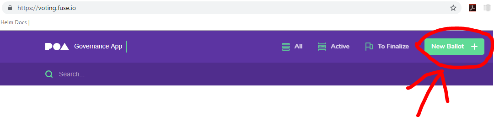
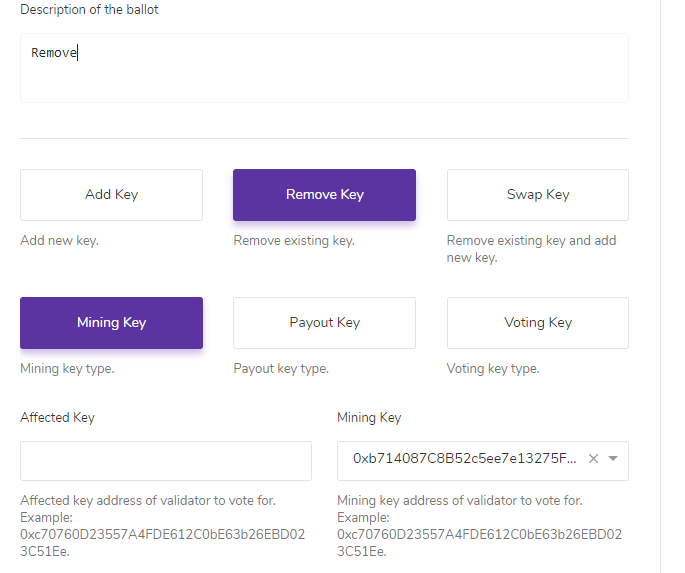

# Network validator management at Fuse

## Adding a validator

To add a new validator follow the next procedure:

* Generate three wallets any suitable way (for example one can use MyEtherWallet).

* Go to the https://voting.fuse.io and login using one of the validator voting keys. Then create a ballot to add a new validator. 
* Validator will be added right after all the necessary votes from other validators will be gain.
* Once validator is added it can launch it own node. To do that validator will need to have a machine (virtual of physical) with Ubuntu 16 OS installed.
  * Port 30303 should not be blocked via firewall. 
  * Validator should be accessible externally via 30303 port (using NAT or directly).
  * Validator should be able to connect to https://health.fuse.io also.
  * A minimum of 2CPU and 8GB of RAM is advised.
  * Launch a VM. To launch a VM at AWS one can use `github.com/ColuLocalNetwork/deployment-playbooks`. 
    * Prerequisites: `boto3` and `botocore` python modules together with `ansible` installed.
    * Clone repo.
    * Go to the `aws` folder.
    * Copy`group_vars/all.yml.example` to `group_vars/all.yml`. Adjust vars at `group_vars/all.yml`. Among the most important values to change:
      * `region` - AWS region to launch validator at. *Note*: `image` variable differs depends on region.
      * `aws_access_key` and `aws_secret_key` are authentication keypair.
      * `awskeypair_name` - name of the keypair that already exists in the specified `region`. One should create a keypair before using ansible scripts.
      * `vpc_id` and `vpc_subnet_id` can be commented out in order to use the default networks.
      * `<role>_instance_type` and `<role>_count_instances` sets the VM count and the size of each VM accordingly.
    * Get out of AWS folder.
  * Install `Git` and `Ansible`. Clone `github.com/ColuLocalNetwork/deployment-playbooks` if it is not already cloned.

  - Copy`hosts.example` to `hosts` file . Comment out `node*.example.com` variables and fill the file section with the IP or DNS names of the created validators. Fill others sections as well if needed.

  - Copy ``group_vars/validator.yml.example` to `group_vars/validator.yml`. Adjust variables. The most important are:

    | **Variable name**   | **Variable description**                                     |
    | ------------------- | ------------------------------------------------------------ |
    | NODE_FULLNAME       | Name of the name. Will be shown at health.fuse.io            |
    | NODE_ADMIN_EMAIL    | Contact email of admin of the node                           |
    | NETSTATS_SERVER     | Address of the netstat server. For fuse network should be like "https://health.fuse.io" |
    | NETSTATS_SECRET     | Password for NETSTAT_SERVER                                  |
    | MINING_KEYFILE      | JSON keystore file content of Mining key of the validator    |
    | MINING_ADDRESS      | Public address of Mining key (like `0x12345...`)             |
    | MINING_KEYPASS      | Password for MINING_KEYFILE                                  |
    | install_debug_tools | Whether to install or not operator tools like `mc` and `htop` or not. Those packages are not required for validator itself. |

  - Execute Ansible playbooks. Run `ansible-playbook validator.yml -i hosts`. Ansible will install and launch the validator.

## Removing a validator

To remove a validator simply go to the https://voting.fuse.io and login using one of the validator voting keys. Then create a ballot to remove **mining** key of validator. Voting and payout will be disabled automatically once minimum of votes will be gain.

## Master of Ceremony

Master of Ceremony is also used to validate blocks and can be removed from the network once the initial ceremony is complete and network has **at least three other validators.** However, it is highly recommend to backup MoC hard drive to prevent losing any data. 

To remove Master of Ceremony:

* Add MoC key to the certifier contract. 
* Backup MoC disk
* Complete the default process of removing the validator using ballots
* Shutdown and terminate the MoC instance

# Bridge validator management at Fuse

## Adding a validator

1. Stop all bridge instances or make sure not transactions will be made during the procedure.
2. Call `addValidator` from the validator contract on both sides for every validator account
3. Set a new number of required signatures by `setRequiredSignatures`
4. Start bridge instances:
   - Use [this](https://github.com/ColuLocalNetwork/deployment-bridge/tree/master/bridge-nodejs) detailed instruction to launch an instance using Ansible.

## Removing a validator

1. Stop all bridge instances or make sure not transactions will be made during the procedure.
2. Remove validator from the validator contract on both sides.
3. Set a new number of required signatures by `setRequiredSignatures`.
4. Terminate removed bridge instances.

## References

https://github.com/poanetwork/wiki/wiki/Governance-Overview

https://github.com/poanetwork/wiki/wiki/Manage-Validator-Ballots